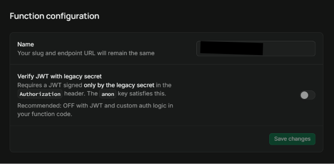
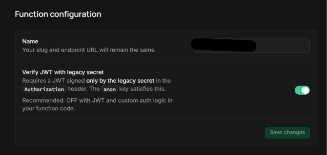

# SEC-001 - Edge Function Authentication

- ditemukan: 16/07/2026
- diperbaiki: 17/07/2026

## Scope
- Repository: spmb-baitunnaim
- Component: Supabase Edge Function (`keepalive`)
- Environment: Staging

## Status
- [ ] Open
- [x] Resolved

## Risk
Low

## Finding
Edge Function dikonfigurasi dengan opsi Verify JWT dinonaktifkan sehingga endpoint dapat diakses secara publik tanpa autentikasi JWT.

## Impact
Endpoint dapat dipanggil oleh pihak yang tidak terautentikasi sehingga meningkatkan risiko penyalahgunaan, seperti *request flooding*, konsumsi *invocation* yang berlebihan, dan penggunaan *resource* yang dapat mempercepat habisnya kuota layanan.

## Recommendation
### Remediation:
Aktifkan opsi Verify JWT pada Edge Function agar setiap request wajib menyertakan token JWT yang valid sebelum fungsi dieksekusi.

## Evidence

### Before
#### Evidence 1
- Source: Supabase Edge Function Settings
- Log / Screenshot: Konfigurasi Verify dalam keadaan mati/off.


### After
#### Evidence 2
- Source: Supabase Edge Function Settings
- Log / Screenshot: Konfigurasi Verify sudah diaktifkan.

#### Evidence 3
- Source: Terminal WSL
- Log / Screenshot: cURL tanpa Authorization header (JWT) menghasilkan error 401.
    ```bash
    ~$ curl -L -X POST '[https://rywammolujagaasauldp.supabase.co/functions/v1/keepalive](https://rywammolujagaasauldp.supabase.co/functions/v1/keepalive)' \
    -H 'Content-Type: application/json' \
    --data '{"name":"Functions"}' -w "\n"
    {"code":"UNAUTHORIZED_NO_AUTH_HEADER","message":"Missing authorization header"}
    ```
#### Evidence 4
- Source: Log Supabase
- Log / Screenshot: Log server mencatat error 401 atas request cURL dari WSL.
    ```json
    {
        "headers_user_agent": "curl/8.5.0",
        "client_ip": "114.5.232.106",
        "event_message": "POST | 401 | https://rywammolujagaasauldp.supabase.co/functions/v1/keepalive"
    }
    ```
#### Evidence 5
- Source: Log Supabase
- Log / Screenshot: Log server mencatat error 500 yang diharapkan atas request Github Actions.
    ```json
    Log Edge Function:
    {
        "client_ip":"20.109.95.98",
        "client_timezone": "America/New_York",
        "event_message": "POST | 500 | https://rywammolujagaasauldp.supabase.co/functions/v1/keepalive"
    }

    Log Postgres:
    {
        "backend_type": "client backend",
        "event_message": "permission denied for table master_tahun_ajaran"
    }
    ```
## Validations
- [x] **Dashboard Integrity:** Opsi *Verify JWT* terkonfirmasi aktif pada Supabase Dashboard.
- [x] **Negative Test (Tanpa Token):** Request tanpa `Authorization` header menghasilkan error `401 Unauthorized`.
- [x] **Normal Test (Github Actions):** Request Github Action menggunakan JWT sudah berjalan normal dengan `500 Server Error` akbiat proteksi RLS `Access Denied`.